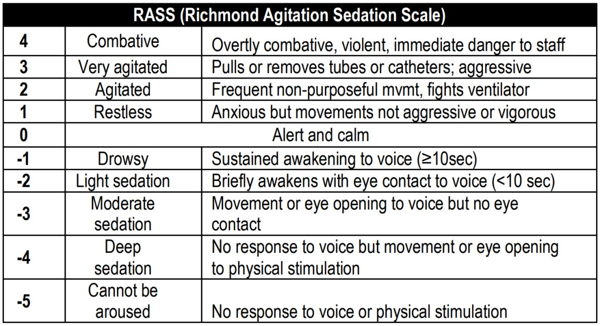
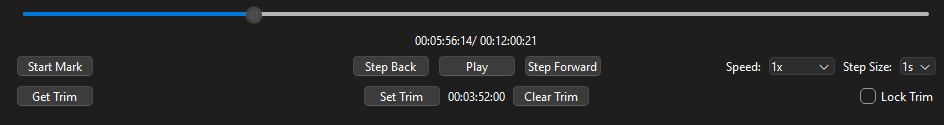

# Table of Contents

## A. Introduction
1) [MVP](#a1-mvp)
2) [Requirements](#a2-requirementsdependencies)
## B. Input/Output
1) [Video](#b1-video)
2) [9-axis IMU](#b2-9-axis-imu)
3) [Annotations](#b3-annotation-inputoutput)
## C. Features
1) [Video Player](#c1-video-player-video-widget)
2) [Annotation](#c2-annotation)
3) [Seek (non-critical)](#c3-seek)
4) [Sensor Timeline](#c4-sensor-timeline-timelinewidget)
5) [Alignment](#c5-alignment)
## D. Modules
1) [Architecture / Class interaction diagram](#d1-architecture--class-interaction-diagram)
2) [TimeKeeper](#d2-timekeeper)
3) [SpanKeeper](#d3-spankeeper)
4) [Grapher](#d4-grapher)
5) [HDF5 reader](#d5-hdf5-reader)
6) [JSON reader/writer](#d6-json-readerwriter)
## E. Workflow
1) [Annotation](#e1-annotation)
2) [User Interface](#e2-ui)
3) [Alignment](#e3-alignment)

---

# A. Introduction
A standalone Python program that runs on Windows to be used by medical researchers to annotate videos paired with waveforms from accelerometers, gyroscopes, and magnetometers. The video and signals are aligned allowing the user to assign meaning to the signals based on what is happening in the videos. The program must allow video navigation, variable playback, annotation, and a seek function. For annotation the user needs to select a portion of the video and then input their annotation/comments. The seek function needs to identify jumps or large changes in the waveform and display the corresponding video portion.

The annotations which are described in detail in C2 are all related to the Richmond Agitation Sedation Scale or RASS. This score is used in ICU setting to quantify how agitated a given patient. These annotations will be used to train a model that can act as a "nanny" autonomously monitoring patients 

## A1. MVP 
The MVP must be capable of the following: importing the signals and video, playing back the video, and exportable annotations.

## A2. Requirements/Dependencies
Python version 3.11.2, PySide6 version 6.2.7, ruptures version 1.1.10, numpy, scipy, h5py

# B. Input/Output
## B1. Video
* Selected using the hosts file navigator.
* Will be a mp4, with an arbitrary fps and resolution TBD at read time.
* Lengths will vary but can be up to 72 hours, so will need to process in chunks

## B2. 9-axis IMU
* Two 9-axis IMUs one for each wrist collecting data simultaneously
  - Some movements/actions are multi handed and collecting data from both wrists will alow us to model said actions
  - Dangerous action can involve only a single hand so we need to monitor both  
* Each session will be stored in a single HDF5 file.
  - The individual sensors data will be stored in `HDF5 datasets`
* Selected using the hosts file navigator.
* Will have an Arbitrary sampling rate not exceeding 100hz
* C1 - C3:  x, y, and z of accelerometer.
* C4 - C6:  x, y, and z of the gyroscope.
* C7 - C9: x, y, and z of magnetometer.
* C10 - C13: quaternion values. (won't be used by our system)
* C14: time stamp used for syncing (to be used for alignment stretch goal)
* C15: instantaneous time stamp

## B3. Annotation Input/Output
* Selected using the hosts file navigator.
* Will be a JSON
* Each annotation will contain
  - Start and Stop time stamps
  - Sidedness (left or right wrist)
  - A RASS score from +4 to -5
  - A movement characteristic chosen from a predetermined list
    * Note/Reasoning for choosing selecting said characteristic
  - A free form comment

# C. Features
## C1. Video Player (video widget)
* Video playback without sound
* Given the potential size of the mp4s they will need to be loaded in chunks, when playing these chunks they should transition seamlessly. Pyside6 handles this automatically
* Controls
  - Pause/Play
  - Adjustable playback speed
  - Seek button (see Seek for more info, stretch goal)
  - Video scrubbing
  - Start/End Mark toggle button see (SpanKeeper for implementation specifics)
  - Set Trim (set first shown frame to current postion)
  - Clear Trim (removes trim)
  - Lock Trim (prevents setting or clearing trim)
  - Get Trim (prints trim in ms to console)

## C2. Annotation
Two types of annotations span annotation and instantaneous annotations. Span annotations are annotations that span from a start time to stop time. Instantaneous annotations are annotations for specific points in time
* Prompt user to give annotation after endflag is set or specify if its an instantaneous annotation 
* Each span annotation will have
  - Dropdown selector for RASS score can choose +4 to -5
  - Dropdown of predetermined movement characteristics (TBD) accompanied by a free form comment box to contain rational
* General freeform comment box (filling out optional)
  - Each Instantaneous annotation will have
  - General freeform comment box (filling out required)

## C3. Seek
The seek function finds and allows users to jump to a point in time where there is a notable change in actigraphy. The technical term for this is [offline change point detection](https://en.wikipedia.org/wiki/Change_detection#Offline_change_detection) (OCPD). To do this we will be utilizing the python [ruptures](https://github.com/deepcharles/ruptures) python package.
* The OCPD algorithm will process the vector sum of acceleration vectors. We are only using the acceleration vectors for this because it keeps it simple and there is research showing a high correlation between RASS scores and absolute acceleration values.
* After identifying the points of interest using OCPD their timestamps will be recorded by the TimeKeeper class where the seek buttons in the video player can access them. 
* Get timestamps of the change points and give them to the video player so it can “jump” to them.

## C4. Sensor Timeline (TimelineWidget)
The sensor timeline uses a grapher with an hdf5 reader to display sequential data points from various sensors in a configurable UI element.
* Shows a line graph of sensor data for easy visualization
* A graph with 2 lines for the magnitude values of 2 sensors used
* Responsible for the creation of a new graph when loading data
* Connects data offset adjustment controls with the graph for aligning sensor times

## C5. Alignment
The alignment process will involve being able to specify how many indices to skip. It will give the appearance of cropping but the files are not edited. After the alignment process is finished the user will be able to lock the modalities together as to avoid accidentally unsyncing them, additionally the user will be able to save the new starting indices to be loaded at a future time
* Uses the the sensor graph and video player
* Enabled by syncing action e.g. smacking the sensors together in front of the camera
* Align the two sensors based on the peaks and then align those with the action seen in the video.
* See C1 for video alignment tools 

# D. Modules
## D1. Architecture / Class Interaction Diagram

## D2. TimeKeeper
The TimeKeeper module is responsible for keeping track of the current position in the video and syncing all other widgets to that time. It will be created as a singleton and be assigned the QMediaPlayer created by the VideoWidget. The TimeKeeper module monitors the positionChanged signal emitted by the QMediaPlayer to keep track of the current position. It then emits a signal that the other widgets monitor. The TimeKeeper keeps track of the following:
* The Current video position
* The window size
* Left window bound (> 0)
* Right window bound

## D3. SpanKeeper
The SpanKeeper allows for the creation and storage of individual Spans which store the start and stop time of span annotations.
* Used by annotations to keep track of span annotations
* Used by video player scrubber to display annotated portions of the video on the timeline
* Begin flag and end flag button from video player act as input

## D4. Grapher
The Grapher manages a graphics system for drawing a line graph of data over time inside of a widget. It dynamically resizes and follows the video time for position with a cursor in the center of the graph for reference.
* Managed by timeline widget
* Automatically scrolls in sync with video when playing or scrubbing
* User can zoom and pan the x-axis when video is paused, then resets once played
* More advanced control behind context menu from right clicking

## D5. HDF5 reader
The HDF5 Reader module is responsible for handling the dynamic loading of the of the 9-axis IMU sensor data. The module uses HDF5 underlying functionality to chunk the data enabling us to not load any more data into RAM than we are displaying this is especially critical because of the potentially very large files (upto 72 hours).
* Used by the Sensor Timeline and Grapher to load in the data from the wrist-mounted IMU sensors
* Parses out acceleration acceleration values, and converts them from Analog-to-Digital Converter (ADC) Counts to meters a second `accl_range/adc_range * value` where `accl_range` is (+/-8g) and adc_range is `32767.0`
* After conversion it applies the vectors magnitude for plotting.
* Allows each of the sensors to be chunked independently as to allow for alignment functionality

## D6. JSON reader/writer
The JSON Reader/Writer module is responsible for the persistent storage of annotation data so that user work can be saved, reloaded, and exported between sessions.
* Used by the annotation system to import previously saved annotation files and export newly created annotations in JSON format
* Reads and writes all required annotation fields, including start and stop timestamps, sidedness, RASS score, movement characteristic, reasoning, and free-form comments
* Reconstructs saved annotations for display in the interface and ensures that exported annotations remain portable, reusable, and consistent with the application requirements
* Supports the MVP goal of producing exportable annotations and serves as the main persistence layer for user-generated annotation data

# E. Workflow
## E1. Annotation 
Note this illustrates the process for span annotations. The process for instantaneous annotations is the same except you press the flag button

## E2. UI
The figures below show our target user interface and a QT layout to achieve it. Small details like video controls and dropdown menus are not shown here and are subject to change during the design and testing process as a deeper understanding of the workflow is obtained.

## E3. Alignment 
Each sensor and the camera is in its own time system. To sync the modalities each data collection session is started by taking the two sensors one in each hand and smacking them together 3 times in front of the camera. The annotator will be able to use these peaks to align the sensors to one another and then to the video. The program will have (+/-)
buttons that allow the user to change the t0 of the wave forms and a set trim button to change the displayed beginning of the video.

---

[Go to Table of Contents](#table-of-contents)
