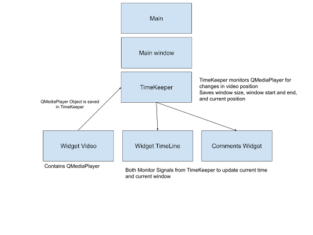
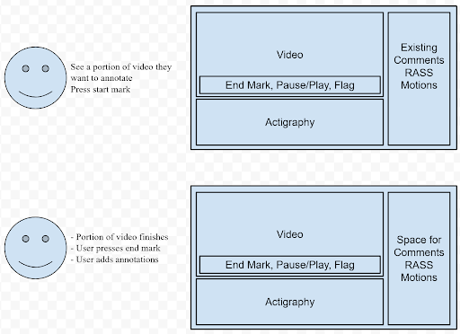
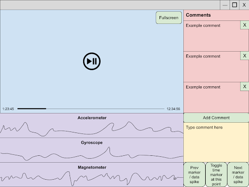
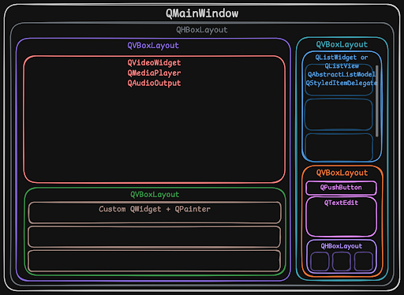

# Table of Contents

## A. Introduction 
1) MVP
2) Requirements
## B. Input/Output
1) Video
2) 9-axis IMU
3) Annotations
## C. Features
1) Video Player
2) Annotation
3) Seek
4) Sensor Timeline
5) Alignment (non-critical)
## D. Modules
1) Architecture / Class interaction diagram
2) TimeKeeper
3) Grapher
4) CSV reader
5) SpanKeeper
6) JSON reader/writer
## E. Workflow
1) Annotation
2) Interaction diagram
3) Alignment (non-critical)
## F. UI
1) Graphical hierarchy

# A. Introduction
A standalone Python program that runs on Windows to be used by medical researchers to annotate videos paired with waveforms from accelerometers, gyroscopes, and magnetometers. The video and signals are aligned allowing the user to assign meaning to the signals based on what is happening in the videos. The program must allow video navigation, variable playback, annotation, and a seek function. For annotation the user needs to select a portion of the video and then input their annotation/comments. The seek function needs to identify jumps or large changes in the waveform and display the corresponding video portion.

## A1. MVP 
The MVP must be capable of the following: importing the signals and video, playing back the video, and exportable annotations.

## A2. Requirements/Dependencies
Python version 3.13.12, PySide6 version 6.2.7, ruptures version 1.1.10, numpy, scipy

# B. Input/Output
## B1. Video
* Selected using the hosts file navigator.
* Will be a mp4, with an arbitrary fps and resolution TBD at read time.
* Lengths will vary but can be up to 72 hours, so will need to process in chunks

## B2. 9-axis IMU
* Up to 2 files (2 sensors collected data simultaneously one on each wrist). 
* Selected using the hosts file navigator.
* Will be a CSV.
* Will have an Arbitrary sampling rate not exceeding 100hz
* C1 - C3:  x, y, and z of accelerometer.
* C4 - C6:  x, y, and z of the gyroscope.
* C7 - C9: x, y, and z of magnetometer.
* C10 - C13: quaternion values. (won't be used by our system)
* C14: time stamp used for syncing (to be used for alignment stretch goal)
* C15: instantaneous time stamp

## B3. Annotation Input/Output
* Selected using the hosts file navigator.
* Will be a JSON
* Each annotation will contain
  - Start and Stop time stamps
  - Sidedness
  - A RASS score from +4 to -5
  - A movement characteristic chosen from a predetermined list
    * Note/Reasoning for choosing selecting said characteristic
  - A free form comment

# C. Features
## C1. Video Player (video widget)
* Video playback without sound
* Given the potential size of the mp4s they will need to be loaded in chunks, when playing these chunks they should transition seamlessly. Pyside6 handles this automatically
* Controls
  - Pause/Play
  - Adjustable playback speed
  - Seek button (see Seek for more info)
  - Video scrubbing
  - Begin flag and end flag button (see SpanKeeper for implementation specifics) these are to be used for span annotations
  - Instantaneous flag: this is to be used for instantaneous annotations

## C2. Annotation
Two types of annotations span annotation and instantaneous annotations. Span annotations are annotations that span from a start time to stop time. Instantaneous annotations are annotations for specific points in time
* Prompt user to give annotation after endflag is set
* Each span annotation will have
  - Dropdown selector for RASS score can choose +4 to -5
  - Dropdown of predetermined movement characteristics (TBD) accompanied by a free form comment box to contain rational
* General freeform comment box (filling out optional)
  - Each Instantaneous annotation will have
  - General freeform comment box (filling out required)

## C3. Seek
The seek function finds and allows users to jump to a point in time where there is a notable change in actigraphy. The technical term for this is [offline change point detection](https://en.wikipedia.org/wiki/Change_detection#Offline_change_detection) (OCPD). To do this we will be utilizing the python [ruptures](https://github.com/deepcharles/ruptures) python package.
* The OCPD algorithm will process the vector sum of acceleration vectors. We are only using the acceleration vectors for this because it keeps it simple and there is research showing a high correlation between RASS scores and absolute acceleration values.
* After identifying the points of interest using OCP their timestamps will be recorded by the TimeKeeper class where the seek buttons in the video player can access them. 
* Get timestamps of the change points and give them to the video player so it can “jump” to them.

## C4. Sensor Timeline (TimelineWidget)
The sensor timeline makes use of the grapher and csv reader to display sequential data points from various sensors in a configurable UI element.
* Shows a line graph of sensor data for easy visualization
* 3 graphs with 3 lines each for x, y, and z values of the 3 sensors used
* Reads the data with csv reader and displays it with grapher
* Responsible for the synchronization between the two systems

## C5. Alignment (stretch goal still brainstorming)
* Uses the the sensor graph and video player
* Enabled by syncing action e.g. smacking the sensors together in front of the camera
* Align the two sensors based on the peaks and then align those with the action seen in the video.

# E. Modules
## E1. Architecture / Class Interaction Diagram

## E2. TimeKeeper
The TimeKeeper module is responsible for keeping track of the current position in the video and syncing all other widgets to that time. It will be created as a singleton and be assigned the QMediaPlayer created by the VideoWidget. The TimeKeeper module monitors the positionChanged signal emitted by the QMediaPlayer to keep track of the current position. It then emits a signal that the other widgets monitor. The TimeKeeper keeps track of the following:
* The Current video position
* The window size
* Left window bound (> 0)
* Right window bound

## E3. SpanKeeper
The SpanKeeper allows for the creation and storage of individual Spans which store the start and stop time of span annotations.
* Used by annotations to keep track of span annotations
* Used by video player scrubber to display annotated portions of the video on the timeline
* Begin flag and end flag button from video player act as input

## E4. Grapher
The Grapher manages a graphics system for drawing a data graph inside of a widget. It dynamically resizes based on window size and numerous other configurable parameters.
* Used by timeline to display the sensor data received from csv reader
* Allow user interaction to manipulate graph parameters using scrolling with modifier keys and possibly a settings menu
* Automatically scrolls with video and can be scrolled by the user as well

## E5. CSV reader
The CSV Reader module is responsible for importing, validating, and organizing the IMU sensor data used throughout the timeline and graphing system.
* Used by the Sensor Timeline and Grapher to load sensor data from one CSV file collected from the wrist-mounted sensors
* Parses accelerometer, gyroscope, magnetometer, and timestamp fields from the CSV format defined in the system requirements, while ignoring quaternion values that are not used by the application
* Preserves synchronization and instantaneous timestamp data so the sensor signals can be plotted correctly and later aligned with the video
* Validates incoming CSV structure and converts the raw file contents into an internal data format suitable for visualization and future seek/alignment functionality

## E6. JSON reader/writer
The JSON Reader/Writer module is responsible for the persistent storage of annotation data so that user work can be saved, reloaded, and exported between sessions.
* Used by the annotation system to import previously saved annotation files and export newly created annotations in JSON format
* Reads and writes all required annotation fields, including start and stop timestamps, sidedness, RASS score, movement characteristic, reasoning, and free-form comments
* Reconstructs saved annotations for display in the interface and ensures that exported annotations remain portable, reusable, and consistent with the application requirements
* Supports the MVP goal of producing exportable annotations and serves as the main persistence layer for user-generated annotation data

# F. Workflow
## F1. Annotation 
Note this illustrates the process for span annotations. The process for instantaneous annotations is the same except you press the flag button

## F2. UI
The figures below show our target user interface and a QT layout to achieve it. Small details like video controls and dropdown menus are not shown here and are subject to change during the design and testing process as a deeper understanding of the workflow is obtained.

## F3. Alignment (stretch goal still brainstorming)
Each sensor and the camera is in its own time system. To sync the modalities each data collection session is started by taking the two sensors one in each hand and smacking them together in front of the camera. The user would be able to drag the wave forms of each sensor to align their peaks, once the wave forms are aligned they could lock them together and then drag and align them with the video, which could then be locked.

